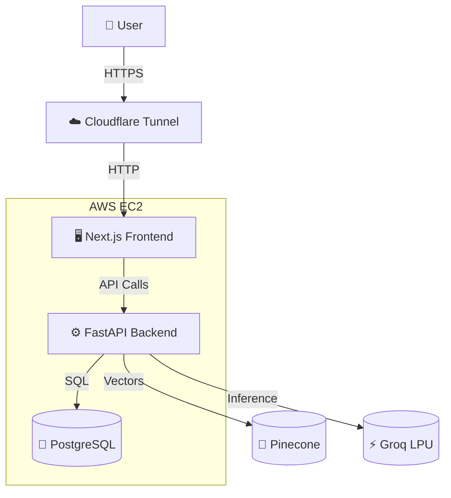
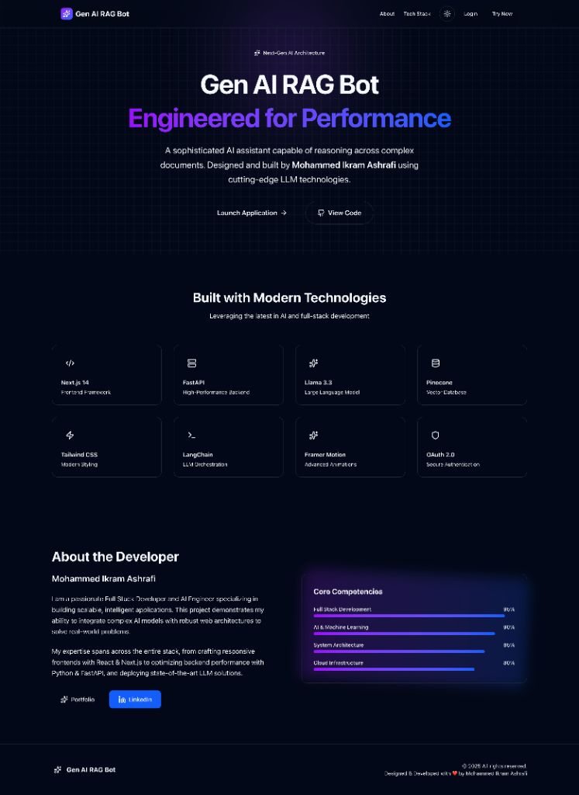
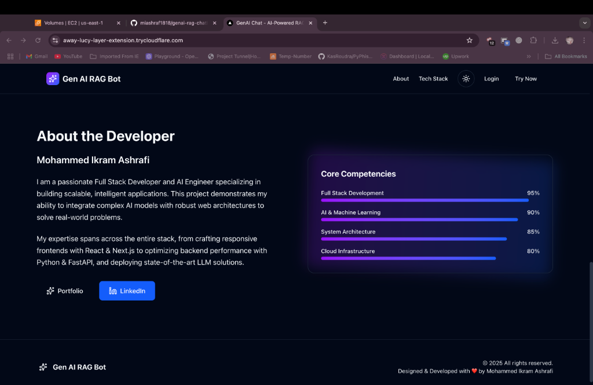
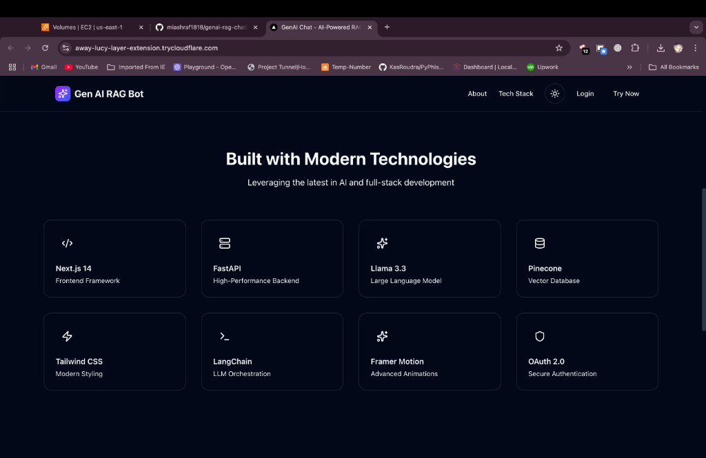
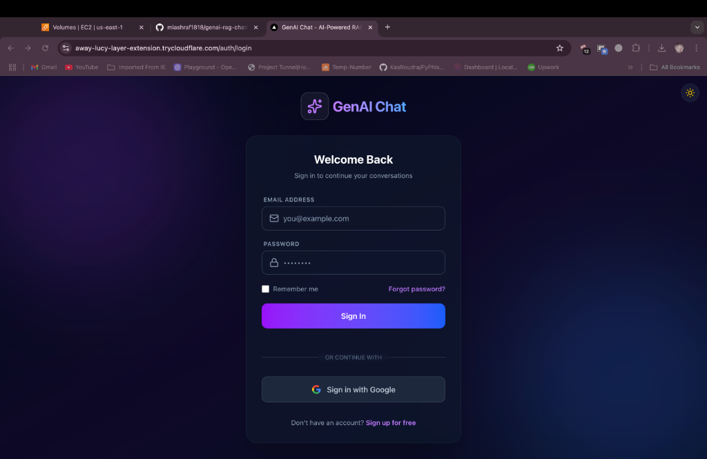

# 🤖 GenAI RAG Chatbot

A production-ready, full-stack AI chatbot application featuring **Retrieval-Augmented Generation (RAG)**, real-time streaming, and secure user authentication. Built with modern "DevOps" practices using Docker and AWS.


## ✨ Key Features

### 🧠 Advanced AI Capabilities
This project is a RAG (Retrieval-Augmented Generation) chatbot that allows users to upload documents (PDF, DOCX, TXT) and chat with them using an LLM (Llama 3 via Groq). It features a modern, responsive UI built with Next.js and a robust FastAPI backend.

> **Latest Update:** Optimized for AWS EC2 t2.micro deployment (CPU-only inference).
-   **Smart Context**: Uses **Pinecone** vector database to retrieve relevant info for every query.
-   **Llama 3 Powered**: Integrated with **Groq** for lightning-fast AI responses.
-   **Streaming Responses**: Real-time text generation (like ChatGPT) using WebSockets.

### 🔒 Security & Auth
-   **Google OAuth 2.0**: Secure "Login with Google" integration.
-   **User Isolation**: Each user only sees *their* own documents and chat history.
-   **JWT Sessions**: Stateless, secure session management.

### 💻 Modern UI/UX
-   **React + TypeScript**: Fast, type-safe frontend.
-   **Chat History**: Saves all your conversations automatically.
-   **Dark/Light Mode**: Beautiful UI with theme switching.
-   **Responsive Design**: Works on desktop and mobile.

### ⚙️ DevOps & Backend
-   **Dockerized**: Full stack (Frontend, Backend, Database) runs in containers.
-   **PostgreSQL**: Robust relational database for user data and history.
-   **AWS Ready**: Configured for deployment on EC2.
-   **Cloudflare Tunnel**: Secure exposure without opening firewall ports (Optional).

---

## 🏗️ Architecture



## 🌐 Live Demo

The application is live and accessible via a secure Cloudflare Tunnel:

👉 **[Launch GenAI Chatbot](https://away-lucy-layer-extension.trycloudflare.com)**

*(Note: This is a demo environment running on AWS Free Tier. Initial load might take a few seconds.)*

---

## 📸 Screenshots

### Landing Page


### Tech Stack & Architecture


### Developer Profile


### Secure Login


### Chat Interface


### File Upload & RAG


### Admin Dashboard


### User Management


---

## 🛠️ Tech Stack

| Component | Technology |
| :--- | :--- |
| **Frontend** | React 18, Next.js 14, TypeScript, Tailwind CSS |
| **Backend** | FastAPI (Python 3.11), SQLAlchemy, Pydantic |
| **Database** | PostgreSQL 15 (Data), Pinecone (Vectors) |
| **AI Model** | Llama 3-8b-8192 (via Groq API) |
| **Infrastructure** | Docker, Docker Compose, AWS EC2, Nginx/Cloudflare |

---

## 🚀 Quick Start (Local)

### Prerequisites
-   Docker & Docker Compose
-   Git

### 1. Clone the Repository
```bash
git clone https://github.com/miashraf1818/genai-rag-chatbot.git
cd genai-rag-chatbot
```

### 2. Configure Environment
Copy the example env file:
```bash
cp .env.example .env
```
Edit `.env` and add your API keys (Groq, Pinecone, Google OAuth).

### 3. Run with Docker
```bash
docker compose up -d --build
```

### 4. Access the App
-   **Frontend**: [http://localhost:3000](http://localhost:3000)
-   **Backend API**: [http://localhost:8000/docs](http://localhost:8000/docs)

---

## ☁️ Deployment (AWS EC2)

The application is successfully deployed on AWS EC2.

*   **Infrastructure**: Docker Compose on Ubuntu `t2.micro`.
*   **DNS Strategy**: `nip.io` for wildcard resolution (Google OAuth compliance).
*   **Security**: Cloudflare Tunnel for secure HTTPS access.

👉 **Read the full [Deployment Summary & Technical Notes](DEPLOYMENT_SUMMARY.md)** for architecture details, performance benchmarks, and design decisions.

### Brief Overview:
1.  Launch an Ubuntu EC2 instance.
2.  Install Docker & Git.
3.  Clone repo and set production `.env`.
4.  Run `docker compose up -d --build`.

---

## 📂 Project Structure

```
genai-rag-chatbot/
├── backend/            # FastAPI Application
│   ├── api/           # API Routes (Chat, Auth, Files)
│   ├── database/      # DB Models & Connection
│   ├── llm/           # Llama 3 & Groq Logic
│   └── vectorstore/   # Pinecone Integration
├── frontend/           # Next.js Application
│   ├── app/           # React Pages & Components
│   └── public/        # Static Assets
└── docker-compose.yml  # Container Orchestration
```

---

## 🤝 Contributing

Contributions are welcome! Please feel free to submit a Pull Request.

## ⚖️ Trade-offs & Design Decisions

Every architecture has trade-offs. Here is how we addressed common RAG challenges:

| Challenge | Our Solution | Why? |
| :--- | :--- | :--- |
| **Latency** | **Groq LPU** | Traditional LLM inference is slow. Groq provides near-instant tokens/sec, essential for a "chat" feel. |
| **Scalability** | **Next.js + Docker** | Unlike Streamlit (prototyping), Next.js is production-ready. Docker ensures consistent deployment. |
| **Security** | **OAuth2 + RLS** | We implemented strict **Row-Level Security** logic. Users can *only* query their own vectors in Pinecone. |
| **Cost** | **Serverless / Free Tier** | Designed to run on AWS Free Tier (EC2 t2.micro) + Pinecone Starter + Groq Free Beta. |

### 🚧 Current Limitations
-   **Context Window**: Limited by Llama 3's context (8k tokens). Very large documents may lose detail in retrieval.
-   **File Types**: Currently supports PDF and TXT. OCR for scanned docs is planned for v2.
-   **Memory**: The t2.micro instance (1GB RAM) requires swap memory for build processes.

---

## 📄 License

This project is licensed under the MIT License.
